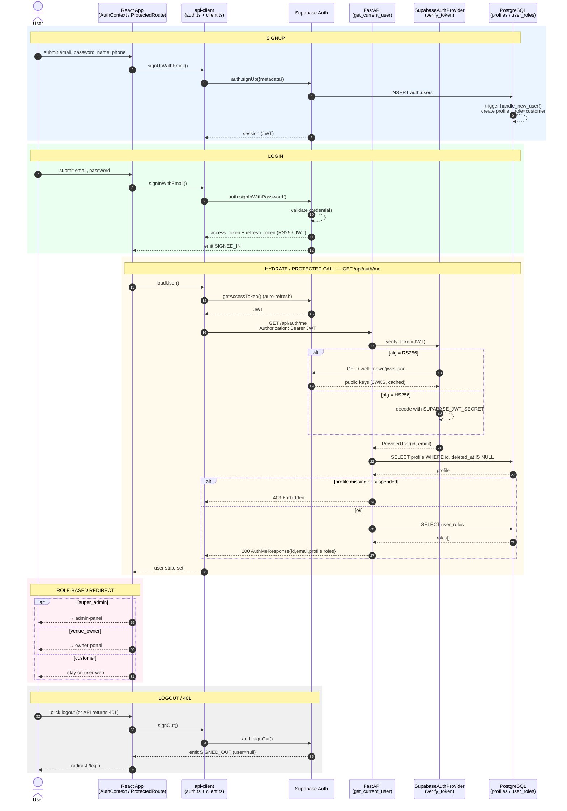
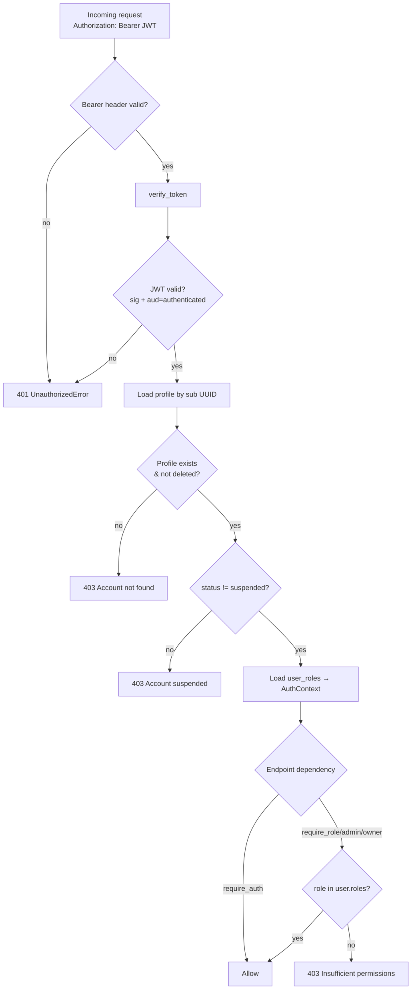

# Venue404 — Authentication Flow

## Architecture Summary

Venue404 is a **pnpm monorepo** with a **FastAPI (Python)** backend and **three React + Vite
frontends** (`user-web`, `owner-portal`, `admin-panel`). Authentication is **Supabase-backed**:

- **Supabase Auth is the source of truth** for credentials, sessions, and JWT issuance.
- The **FastAPI backend never stores passwords or sessions** — it only *verifies* the Supabase
  JWT on each request and maps the user to internal `profiles` + `user_roles` data in PostgreSQL.
- A **shared `packages/api-client`** owns the Supabase client, token injection, and the typed
  API client used by all three frontends.

**Roles:** `customer` (default), `venue_owner`, `super_admin`. Enforced on **both** the client
(route guards) and server (FastAPI dependencies).

### Key files

| Layer | File | Role |
|-------|------|------|
| FE auth fns | `packages/api-client/src/auth.ts` | `signUpWithEmail`, `signInWithEmail`, `signOut`, `getAccessToken`, `onAuthStateChange` |
| FE supabase | `packages/api-client/src/supabase.ts` | Supabase client init (anon key) |
| FE http | `packages/api-client/src/client.ts` | Injects `Authorization: Bearer <jwt>`; on 401 auto-`signOut()` |
| FE context | `apps/*/src/lib/AuthContext.tsx` | React auth state, `loadUser()` → `GET /api/auth/me` |
| FE guard | `apps/*/src/components/ProtectedRoute.tsx` | Client-side route protection + role check |
| FE login | `apps/user-web/src/pages/Login.tsx` | Role-based redirect across apps |
| BE verify | `apps/api/app/modules/auth/providers/supabase.py` | JWT verification (HS256 secret / RS256 via JWKS) |
| BE deps | `apps/api/app/modules/auth/dependencies.py` | `get_current_user`, `require_role/admin/owner` |
| BE route | `apps/api/app/modules/auth/routes.py` | `GET /api/auth/me` |
| DB schema | `apps/api/alembic/versions/0001_auth_schema.py` | `profiles`, `user_roles`, `admin_actions` |
| DB trigger | `apps/api/alembic/versions/0002_signup_trigger.py` | Auto-create profile + `customer` role on signup |
| Admin seed | `apps/api/app/modules/admin/service.py` | `seed_super_admin()` via Supabase Admin API on startup |

---

## Flow descriptions

### 1. Signup
1. Frontend collects email/password/fullName/phone → `signUpWithEmail()` → `supabase.auth.signUp()` (metadata `{full_name, phone}`).
2. Supabase inserts into `auth.users`.
3. Postgres trigger `on_auth_user_created` → `handle_new_user()` creates a `profiles` row (`status=active`) and a `user_roles` row (`role=customer`).
4. Supabase fires `SIGNED_IN` → `AuthContext.onAuthStateChange` → `loadUser()` → `GET /api/auth/me` with Bearer token → user hydrated.

### 2. Login
1. `signInWithEmail()` → `supabase.auth.signInWithPassword()`; Supabase validates and returns an access + refresh token.
2. `SIGNED_IN` event → `loadUser()` → `GET /api/auth/me`.
3. Backend `get_current_user`: extract Bearer → `SupabaseAuthProvider.verify_token` (RS256 via JWKS, or HS256 via secret; audience `authenticated`) → load `profiles` (reject if missing/suspended) → load `user_roles` → return `AuthContext`.
4. Frontend `Login.tsx` redirects by role: `super_admin`→admin-panel, `venue_owner`→owner-portal, `customer`→user-web.

### 3. Authenticated API call
`client.ts` calls `getAccessToken()` (Supabase auto-refreshes), adds `Authorization: Bearer`, hits FastAPI. Endpoint depends on `get_current_user` / `require_role(...)`. A `401` makes the client auto-`signOut()`.

### 4. Logout
`signOut()` → `supabase.auth.signOut()` → `SIGNED_OUT` event → `AuthContext` clears `user` → `ProtectedRoute` redirects to `/login`.

### 5. Admin seed (startup)
On FastAPI startup `seed_super_admin()` (idempotent, only if `SUPER_ADMIN_EMAIL/PASSWORD` set) uses the Supabase **Admin API** to create the auth user (no confirm email) and assigns the `super_admin` role.

---

## End-to-end Mermaid diagram (master sequence)

### Supporting diagram — server-side authorization (per request)

---

## Verification
- Render the Mermaid blocks (GitHub preview / VS Code Mermaid extension / mermaid.live) to confirm they parse.
- Cross-check against source: `dependencies.py` (guards), `providers/supabase.py` (HS256/RS256), `client.ts` (Bearer + 401), `0002_signup_trigger.py` (auto profile/role).
