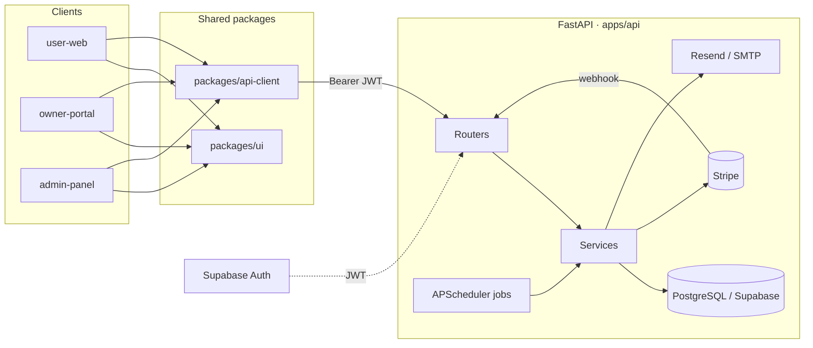
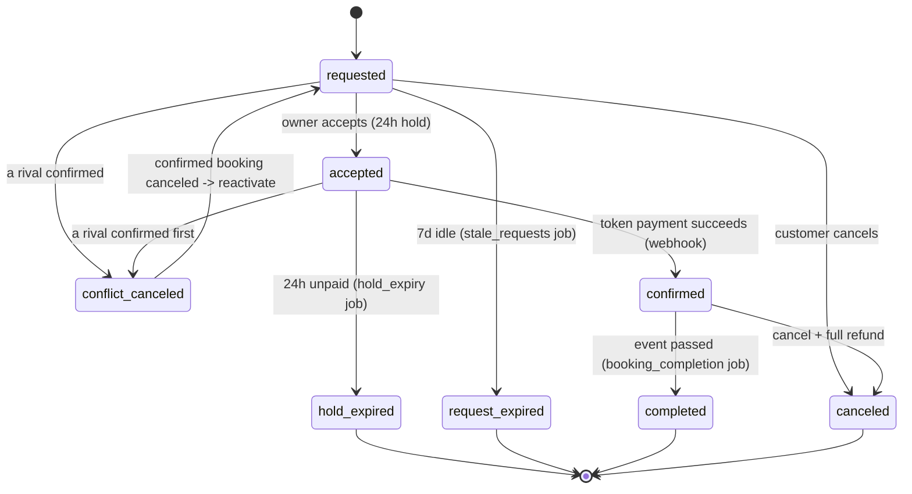

# Venue404 — Payments, Notifications & Platform Architecture

> Scope: the slice owned by Alwin — Payments (Stripe), Notifications (Resend), background
> jobs, shared `packages/ui` + `packages/api-client`, DevOps (CI + deploys), and ~20–30%
> venue support. Companion docs: [PRD](./PRD-payments-notifications-platform.md),
> [schema v2](./schema/venue404_schema_v2.md), [deploy](./DEPLOY.md).
>
> Last updated: 2026-06-10. **Status:** code complete & verified (compile/typecheck/build);
> the `0003` migration is written but **not yet applied** to Supabase; nothing committed
> beyond Task 1 (`fc31070`).

---

## 1. System at a glance



- **Three React apps** (Vite) share **`packages/ui`** (components) and **`packages/api-client`**
  (typed fetch client + Supabase auth helpers).
- **FastAPI backend** (`apps/api`) is organized by module: `auth, profile, venue, search,
  booking, availability, payment, notification, admin`. Each module has
  `routes → service → models/schemas`.
- **Supabase** owns identity (signup/login/JWT). The backend verifies the JWT and loads
  roles from the DB — it never trusts frontend role claims.
- **Stripe** handles charges/refunds; **Resend** (SMTP fallback) sends email.
- **APScheduler** runs time-based jobs in-process (enabled on one instance via `ENABLE_JOBS`).

### Request → authorization flow
1. Client gets a Supabase session (`packages/api-client/src/auth.ts`) and calls the API with
   `Authorization: Bearer <jwt>`.
2. `get_current_user` ([auth/dependencies.py](../apps/api/app/modules/auth/dependencies.py))
   verifies the JWT, loads the `profiles` row + `user_roles`, and builds an `AuthContext`
   (`user_id`, `roles`, `is_admin()`, `is_owner()`).
3. Route dependencies (`require_auth/_role/_owner/_admin`) gate access; **ownership** is
   re-checked in services (e.g. `booking.user_id == current_user.user_id`).

---

## 2. Data model (v2)

All money is integer **paise** (`BigInteger`); all user references are `UUID` FKs to
`profiles.id` (which equals `auth.users.id`). Append-only tables never UPDATE/DELETE.

| Table | Module | Purpose | Migration |
|-------|--------|---------|-----------|
| `profiles`, `user_roles`, `admin_actions` | auth/admin | identity, roles, audit | 0001/0002 |
| `venues` | venue | venue + pricing snapshot + visibility (`status`,`is_active`,`deleted_at`) | 0003 |
| `venue_photos` | venue | photos; **one active cover** (partial unique index) | 0003 |
| `venue_cancellation_policies` | venue | tiered refund schedule (drives refunds) | 0003 |
| `slots`, `blocked_dates` | availability | per-day availability | 0003 |
| `bookings` | booking | lifecycle + pricing + payment state | 0003 |
| `booking_slots` | booking | time ranges; **GIST no-overlap when blocking** | 0003 |
| `booking_status_history` | booking | append-only transition log | 0003 |
| `payments` | payment | read-model of a charge attempt | 0003 |
| `refunds` | payment | refund records | 0003 |
| `ledger_entries` | payment | **append-only money source of truth** | 0003 |
| `payout_requests` | payment | owner withdrawals | 0003 |
| `stripe_events` | payment | **webhook idempotency** (PK = Stripe event id) | 0003 |
| `notifications` | notification | in-app + email tracking | 0003 |

**Enums (0003):** `venue_status` (pending/approved/rejected/suspended),
`booking_status` (8 states, below), `booking_payment_status` (unpaid/pending/paid/refunded),
`payment_attempt_status` (pending/succeeded/failed/refunded), `refund_status`
(pending/succeeded/failed), `payout_status` (requested/processing/paid/failed).

> Not yet modeled (in the PDF design but out of current scope): `amenities`,
> `venue_amenities`, `venue_availability` as a separate table (availability uses
> `slots`/`blocked_dates`).

### Migration mechanics
- `apps/api/alembic/env.py` imports **all** model modules so autogenerate/metadata is complete.
- `0003_core_schema.py` is **hand-written** (enums via `DO` blocks, `btree_gist` extension,
  the GIST exclusion constraint, the partial cover-photo index) — autogenerate cannot produce
  these. It has a full `downgrade()`.
- Apply with the two project commands (against Supabase; **not yet run**):
  `pnpm api:migrate` (= `alembic upgrade head`). See [DEPLOY.md](./DEPLOY.md).

---

## 3. Booking lifecycle (payment-driven)



Transitions are enforced in code by `can_transition()` in
[booking/state_machine.py](../apps/api/app/modules/booking/state_machine.py).

---

## 4. Payments (Stripe)

Files: [payment/service.py](../apps/api/app/modules/payment/service.py),
[webhooks.py](../apps/api/app/modules/payment/webhooks.py),
[routes.py](../apps/api/app/modules/payment/routes.py),
[models.py](../apps/api/app/modules/payment/models.py).

### Endpoints
| Method | Path | Auth | Purpose |
|--------|------|------|---------|
| POST | `/api/payments/` | user (owner of booking) | create PaymentIntent for token advance |
| POST | `/api/payments/webhook` | Stripe signature | confirm/fail on Stripe events |
| POST | `/api/payments/refund` | owner/admin | full refund + cancel |
| GET | `/api/payments/{booking_id}` | booking owner / venue owner / admin | list attempts |

### Create-intent (request path)
`create_payment_intent` locks the booking `FOR UPDATE`, asserts ownership + `accepted` +
live hold, computes **amount server-side** (`venue.base_price_paise × token_advance_pct`,
never client-supplied), creates a Stripe PaymentIntent with `idempotency_key=booking-<id>`,
records a `payments(pending)` row, and returns the `client_secret`.

### Confirmation sequence (webhook path)

```mermaid
sequenceDiagram
    participant C as Customer (Stripe.js)
    participant API as FastAPI
    participant DB as Postgres
    participant S as Stripe
    C->>API: POST /api/payments {booking_id}
    API->>DB: assert booking accepted, hold valid, caller owns it
    API->>S: create PaymentIntent(amount_paise)
    S-->>API: pi.id + client_secret
    API->>DB: insert payments(pending), set booking.stripe_pi
    API-->>C: client_secret
    C->>S: confirm card payment
    S-->>API: webhook payment_intent.succeeded
    API->>DB: INSERT stripe_events (PK = event.id) -- dup = no-op
    API->>DB: BEGIN + SELECT booking FOR UPDATE
    API->>DB: booking accepted->confirmed, payment->succeeded
    API->>DB: ledger_entries(charge); set booking_slots.is_blocking
    API->>DB: rival requests -> conflict_canceled (+refund the paid ones)
    API->>DB: COMMIT -- GIST exclusion blocks double-win
    API-->>C: notify (Resend + in-app) all parties
```

### Race safety (the core invariant)
- The webhook is **idempotent**: each Stripe event is `INSERT`ed into `stripe_events` (PK =
  event id) first; a duplicate raises `IntegrityError` → handler returns `{"status":"duplicate"}`.
- Confirmation runs in **one transaction** with `SELECT ... FOR UPDATE` on the booking.
- Setting `booking_slots.is_blocking = true` is gated by the **GIST exclusion**
  `no_overlapping_blocking_slots` (no two blocking ranges overlap per venue). The losing
  concurrent confirmation hits `IntegrityError`, is rolled back, then **self-conflict-cancels
  and refunds** (`_conflict_cancel_self_and_refund`). → *only one confirmed booking per slot.*
- Competitors (`_find_competing_bookings`) are flipped to `conflict_canceled`; any with a
  succeeded payment are **auto-refunded** (`_conflict_cancel`).

### Money ledger
Every movement writes an append-only `ledger_entries` row: `charge` (credit), `platform_fee`
(debit), `refund` (debit), `payout`. `payments`/`refunds` are convenience read-models over the
same events; `booking.amount_paise/refund_paise/platform_fee_paise` hold the snapshot.

### Refunds
`refund_booking` (owner/admin) issues a Stripe refund, records a `refunds` row + ledger debit,
updates `booking.refund_paise`/`payment_status=refunded`, transitions `confirmed → canceled`,
and releases slots. `_record_refund` is the shared primitive used by cancellation, conflict,
and stray-payment paths.

---

## 5. Notifications (Resend + in-app)

Files: [notification/service.py](../apps/api/app/modules/notification/service.py),
[templates.py](../apps/api/app/modules/notification/templates.py),
[routes.py](../apps/api/app/modules/notification/routes.py).

- `notify(db, user_id, type, context, booking_id)` always writes an in-app `notifications`
  row, then **best-effort** sends the email (Resend → SMTP → dev no-op). Email failure is
  logged and leaves `sent_at` NULL — it never aborts the surrounding DB transaction.
- Recipient email is resolved via the Supabase Admin API (`_get_user_email`) because email
  lives in `auth.users`, not `profiles` (jobs/webhooks have no JWT).
- Transport selection lives in [core/email.py](../apps/api/app/core/email.py); copy/HTML in
  `templates.py` (`render_notification`), degrading gracefully on missing context keys.
- Endpoints: `GET /api/notifications/` (list), `PATCH /api/notifications/{id}/read`
  (ownership-checked).
- **Event catalog:** request_received, new_request_owner, request_accepted, payment_reminder,
  payment_confirmed, hold_expired, conflict_canceled, booking_canceled, refund_issued,
  booking_completed.

---

## 6. Background jobs (APScheduler)

Wired in [jobs/scheduler.py](../apps/api/app/jobs/scheduler.py), started from
[main.py](../apps/api/app/main.py) lifespan when `ENABLE_JOBS=true`. Each job opens a
`with_session()` transaction, transitions state, and notifies.

| Job | Schedule | Effect |
|-----|----------|--------|
| `hold_expiry` | hourly | `accepted` past `hold_expires_at` → `hold_expired` |
| `payment_reminders` | daily 08:00 | T-7/T-3/T-1 reminders for accepted+unpaid |
| `booking_completion` | daily 00:00 | `confirmed` + event passed + paid → `completed` |
| `stale_requests` | every 6h | `requested` older than 7d → `request_expired` |

> Run `ENABLE_JOBS=true` on **exactly one** instance/worker to avoid duplicate runs.

---

## 7. Shared packages

### `packages/api-client`
- `createClient()` ([client.ts](../packages/api-client/src/client.ts)) — typed fetch with
  Bearer auth, `401 → signOut`, and `204` handling.
- Endpoint modules: `auth, venues, bookings, payments, notifications`. Payments exposes
  `createPaymentIntent / refund / getByBooking`; notifications `list / markRead`.
- `scripts/generate.ts` generates `src/types.ts` from the live OpenAPI schema via
  `openapi-typescript` (`pnpm --filter @venue404/api-client generate`).

### `packages/ui`
New primitives consumed by all apps: `PaymentStatusBadge`, `ConfirmPaymentDialog`,
`RefundDialog`, `NotificationList`/`NotificationItem`, and the `formatPaise` helper —
built on the existing `Modal`/`Button`/`StatusBadge`.

---

## 8. DevOps

- **CI** ([.github/workflows/ci.yml](../.github/workflows/ci.yml)): `frontend` job
  (install → lint → build/tsc) and `api` job (Postgres service + `auth` stub →
  `alembic upgrade/downgrade/upgrade` proving migrations are reversible → pytest).
- **API deploy** ([deploy-api.yml](../.github/workflows/deploy-api.yml) + [fly.toml](../apps/api/fly.toml)):
  Fly.io on push to `main`; prod command without `--reload`; **migrations not auto-run**.
- **Web deploy** ([deploy-web.yml](../.github/workflows/deploy-web.yml) + per-app `vercel.json`):
  Vercel, one project per app. Secrets/setup in [DEPLOY.md](./DEPLOY.md).

---

## 9. File map (what changed this effort)

**Backend — implemented**
```
apps/api/app/core/            config.py(+resend/economics/jobs)  database.py(+with_session)
                              stripe_client.py(NEW)  email.py(NEW)  exceptions.py(+BadRequest)
apps/api/app/main.py          start/stop scheduler in lifespan
apps/api/alembic/env.py       import all models
apps/api/alembic/versions/    0003_core_schema.py (NEW, hand-written)
apps/api/app/shared/models.py TimestampMixin -> timezone-aware
apps/api/app/modules/
  venue/         models(UUID,v2)  schemas(aligned)  service(+policy/photos)  routes(+endpoints)
  booking/       models(8-state,UUID,slots)  state_machine(8-state)
  payment/       models(paise,ledger,events)  service(full)  webhooks(full)  routes(full)  schemas
  notification/  models(v2)  service(full)  templates(NEW)  routes  schemas
  availability/  models(UUID)
  search/        schemas(paise)
apps/api/app/jobs/            hold_expiry, payment_reminders, booking_completion, stale_requests
apps/api/tests/               test_state_machine, test_notification_templates, test_email (NEW)
```
**Frontend / packages**
```
packages/api-client/  scripts/generate.ts  src/client.ts  endpoints/payments.ts
                      endpoints/notifications.ts(NEW)  index.ts  package.json
packages/ui/          components/payment/* (NEW)  components/notification/* (NEW)
                      lib/money.ts(NEW)  index.ts
```
**DevOps / docs**
```
.github/workflows/    ci.yml  deploy-api.yml  deploy-web.yml (NEW)
apps/api/fly.toml  apps/*/vercel.json (NEW)
docs/                 PRD, schema/, DEPLOY.md, this file
```

---

## 10. Invariant traceability (confirm against your intent)

| CLAUDE.md invariant | Enforced by | Status |
|---------------------|-------------|--------|
| Only one confirmed booking per slot | GIST exclusion on `booking_slots` + `FOR UPDATE` | ✅ in migration + service |
| Acceptance does not reserve a slot | slots become `is_blocking` only on confirm | ✅ |
| Confirmation requires token payment | webhook `payment_intent.succeeded` → confirm | ✅ |
| Competing requests → conflict_canceled | `_find_competing_bookings` + `_conflict_cancel` | ✅ (event_date overlap; slot-range TODO) |
| User cancellation may reactivate competitors | `conflict_canceled → requested` transition allowed | ⚠️ transition allowed; reactivation trigger lives in booking module |
| Owner cancellation always refunds | `refund_booking` (full) | ✅ |
| Losing payment attempts auto-refunded | `_conflict_cancel` / `_conflict_cancel_self_and_refund` | ✅ |
| Money is integer paise | all `*_paise` BigInteger columns | ✅ |
| Webhooks idempotent | `stripe_events` PK = event id | ✅ |
| Append-only ledger/audit | `ledger_entries`, `booking_status_history`, `admin_actions` | ✅ (no update/delete in code) |
| Frontend never trusted for authz | backend `AuthContext` + ownership checks | ✅ |
| Service-role/Stripe keys never in browser | backend-only settings; apps use anon key | ✅ |

---

## 11. Verification status & how to confirm

**Already verified locally**
- `python3 -m py_compile` on all changed backend files → clean.
- `tsc --noEmit` on `api-client` + `ui` → clean.
- `pnpm build` (all 3 apps) → succeeds.
- `pnpm install` → lockfile synced (CI `--frozen-lockfile` will pass).

**To confirm end-to-end (after you approve the migration + add keys)**
1. `docker compose up -d api` then apply the migration: `pnpm api:migrate`; check
   `alembic current` = `0003` and tables exist in Supabase.
2. Pre-flight mappers: `docker compose exec api python -c "from sqlalchemy.orm import configure_mappers; import app.modules.profile.models, app.modules.venue.models, app.modules.booking.models, app.modules.payment.models, app.modules.notification.models, app.modules.availability.models, app.modules.admin.models; configure_mappers(); print('ok')"`.
3. Run tests: `docker compose exec api pytest -q`.
4. Stripe: `stripe listen --forward-to localhost:8000/api/payments/webhook`, pay with test
   card `4242…`, confirm booking → `confirmed`, ledger + notification rows written; replay the
   event → `{"status":"duplicate"}`.
5. CI: open a PR → `frontend` + `api` jobs green.

---

## 12. Known integration points & caveats (honest list)

- **Booking creation/acceptance** (`booking/service.py`, `routes.py`) are still teammate
  stubs — they must set `accepted_at`, `hold_expires_at`, `amount_paise`, and create
  `booking_slots`. The payment flow degrades gracefully until then (works without slots; the
  GIST race guard only activates once slots exist).
- **Competitor overlap** currently matches venue + `event_date`; switch to slot range-overlap
  once `booking_slots` are populated.
- **Conflict reactivation** on user cancellation: the transition is permitted, but the trigger
  that flips eligible `conflict_canceled → requested` belongs in the booking module.
- **venue/search core CRUD** (`create_venue`, search) remain stubs (teammate scope); I aligned
  their schemas and added the payment-relevant policy/photo endpoints only.
- **0003 not applied** to Supabase, and only Task 1 is committed — everything else is in the
  working tree awaiting your review/commit.
